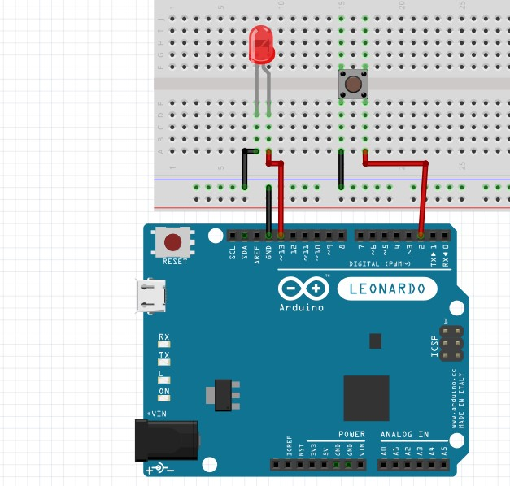

## TcBUTTON Library
A lightweight Arduino library for handling button inputs with debouncing and callback support.


## Overview
TcBUTTON is designed to simplify button handling in Arduino projects. It supports debouncing to filter out noise, pull-up/pull-down configurations, and customizable callbacks for press, release, and state change events.

## Features
- Debouncing: Filters out button bounce with a configurable delay (default: 50ms).
- Pull-up/Pull-down Support: Works with both pull-up and pull-down button circuits.
- Event Callbacks: Define custom functions for button press, release, and state changes.
- Invert Option: Invert the button logic if needed.
- Micros/Millis Timing: Choose between millisecond or microsecond precision for debouncing.

## Installation
1. Download the latest release from the [GitHub repository](https://github.com/Jakkapan-a/TcBUTTON).
2. In the Arduino IDE, go to Sketch > Include Library > Add .ZIP Library and select the downloaded ZIP file.
3. Include the library in your sketch:
```cpp
#include <TcBUTTON.h>
```

## Usage
### Basic Example
```cpp
#include <TcBUTTON.h>

// Define a button on pin 2 with pull-up mode
TcBUTTON button(2);

void setup() {
  Serial.begin(9600);
}

void loop() {
  if (button.isPressed()) {
    Serial.println("Button Pressed!");
  }
}
```

### Advanced Example with Callbacks
```cpp
#include <TcBUTTON.h>

// Callback functions
void onPress() { Serial.println("Pressed!"); }
void onRelease() { Serial.println("Released!"); }
void onStateChange(bool state) { Serial.println(state ? "HIGH" : "LOW"); }

// Button on pin 3 with callbacks
TcBUTTON button(3, onStateChange, onPress, onRelease);

void setup() {
  Serial.begin(9600);
  button.setDebounceDelay(100); // Set debounce delay to 100ms
}

void loop() {
  button.update(); // Manually update button state
}
```

## API Reference
### Constructor
```cpp
TcBUTTON(uint8_t pin, void (*onEventChange)(bool) = nullptr, 
         void (*press)(void) = nullptr, void (*release)(void) = nullptr, 
         bool invert = false);
```
- **pin**: Arduino pin number the button is connected to.
- **onEventChange**: Callback for state changes (optional).
- **press**: Callback for button press (optional).
- **release**: Callback for button release (optional).
- **invert**: Invert the button logic (default: false).

### Methods
- **void begin()**: Initialize the pin mode (called automatically by constructor).
- **bool getState()**: Get the current button state (true for HIGH, false for LOW).
- **bool isPressed()**: Check if the button was just pressed.
- **void update()**: Manually update the button state.
- **void setOnPress(void (*press)())**: Set the press callback.
- **void setOnRelease(void (*release)())**: Set the release callback.
- **void setOnEventChange(void (*onEventChange)(bool))**: Set the state change callback.
- **void setDebounceDelay(uint16_t delay)**: Set debounce delay in milliseconds (or microseconds if useMicros is enabled).
- **void useMicros(bool isMicros)**: Use microseconds (true) or milliseconds (false) for timing.

### Configuration
- **ButtonMode _mode**: Set to **PULLUP** (default) or **PULLDOWN** to match your circuit.
bool isInvert: Set to true to invert button logic.

## Hardware Requirements
- Compatible with any Arduino board.
- Button connected to a digital pin with an appropriate pull-up or pull-down resistor (if not using internal pull-up).

## Contributing
Feel free to submit issues or pull requests on the [GitHub repository](https://github.com/Jakkapan-a/TcBUTTON).

## License
This project is licensed under the MIT License - see the [LICENSE](https://github.com/Jakkapan-a/TcBUTTON) file for details.

## Circuit Diagram
